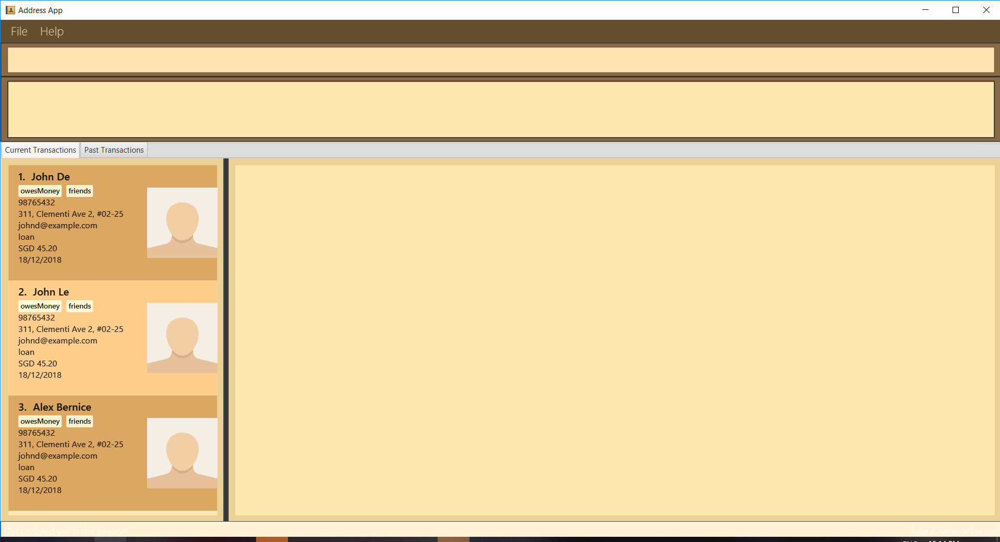

= Debt Tracker
ifdef::env-github,env-browser[:relfileprefix: docs/]

https://travis-ci.org/CS2103-AY1819S1-W12-2/main[image:https://travis-ci.org/CS2103-AY1819S1-W12-2/main.svg?branch=master[Build Status]]
https://coveralls.io/github/CS2103-AY1819S1-W12-2/main?branch=master[image:https://coveralls.io/repos/github/CS2103-AY1819S1-W12-2/main/badge.svg?branch=master[Coverage Status]]
https://ci.appveyor.com/project/aaditkamat/main[image:https://ci.appveyor.com/api/projects/status/3obv2djr0fklonc6?svg=true[Build status]]

ifdef::env-github[]

endif::[]

ifndef::env-github[]
image::images/Ui.png[width="600"]
endif::[]

* This is a desktop Debt Tracker application. It has a GUI but most of the user interactions happen using a CLI (Command Line Interface).
* It is an application to help one keep track of not only their normal expenses, but also their loans (both loans they take and give).
* If managing your finances is getting too messy and complicated, leave it to this application to help you sort them out!
* Who knew managing finances could be so simple?
* While this app is aimed towards SMEs (Small and Medium-sized Enterprises) for them to keep a log of their loans, this app is also available for personal use.
** The Debt Track has a more sophisticated GUI that includes a list  panel and an in-built Browser.
** Support for _Build Automation_ using Gradle and for _Continuous Integration_ using Travis CI.

== Site Map

* <<UserGuide#, User Guide>>
* <<DeveloperGuide#, Developer Guide>>
* <<AboutUs#, About Us>>
* <<ContactUs#, Contact Us>>

== Members
Cheong Kit Wai, Julian +
Lou Shaw Yeong +
Aadit Kamat +
Ysabella Tan Yu Lin +
Lee Wei Qing

== Acknowledgements

* This app was based off https://github.com/nus-cs2103-AY1819S1/addressbook-level4 [Address Book Level 4].
* Some parts of Address Book Level 4 were inspired by the excellent http://code.makery.ch/library/javafx-8-tutorial/[Java FX tutorial] by
_Marco Jakob_.
* Libraries used: https://github.com/TestFX/TestFX[TextFX], https://bitbucket.org/controlsfx/controlsfx/[ControlsFX], https://github.com/FasterXML/jackson[Jackson], https://github.com/google/guava[Guava], https://github.com/junit-team/junit5[JUnit5]

== Licence : link:LICENSE[MIT]
